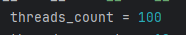

# Experimento de disponibilidad
Este repositorio contiene la solución al experimento de disponibilidad del curso de Arquitecturas ágiles de software. El proyecto fue realizado utilizando [Python](https://www.python.org/downloads/) versión 3.12.4.


## Prerrequisitos

Para levantar este proyecto necesitarás:

* [Python](https://www.python.org/downloads/) (con virtualenv)
* [redis-server](https://redis.io/docs/latest/operate/oss_and_stack/install/install-redis/)
* Copia local de este repositorio.

## Estructura

```
📦 Experimento
├─ monitor
│  └─ app.py
├─ plataforma_de_mensajes
│  └─ app.py
├─ receptor_de_callcenter
│  └─ app.py
└─ requirements.txt
```
Donde:
| Componente / archivo    | Descripción |
| -------- | ------- |
| monitor  | Microservicio encargado de consultar el estado del componente receptor a través de la `plataforma de mensajes`.    |
| plataforma_de_mensajes    | Microservicio encargado de gestionar los mensajes de solicitud y respuesta desde los microservicios `monitor` y `receptor de callcenter`.     |
| receptor_de_callcenter    | Microservicio que ejecutaría la lógica de negocio necesaria y que informa de su estado actual. Configurado para simular una disponibilidad del `90%`    |
| requirements.txt    | Archivo donde se detallan las dependencias necesarias para el proyecto.    |

## Instalación (Linux/MacOS)

En la raiz del proyecto ejecutar los siguientes comandos:
```
python -m venv venv
. venv/bin/activate
pip install -r requirements.txt
```

## Ejecución (Linux/MacOS)

1. Abrir una terminal y ejecutar `redis-server` con el siguiente comando:

    ```
    redis-server
    ```

2. Abrir una terminal en la raíz del proyecto y ejecutar los siguientes comandos para levantar el `monitor (api)`:

    ```
    . venv/bin/activate
    cd monitor
    flask run --port=5000
    ```

3. Abrir una terminal en la raíz del proyecto y ejecutar los siguientes comandos para levantar el `log manager`:

    ```
    . venv/bin/activate    
    celery -A log_manager.celery worker --loglevel=info -Q logs
    ```

4. Abrir una terminal en la raíz del proyecto y ejecutar los siguientes comandos para levantar el `monitor (celery)`:

    ```
    . venv/bin/activate
    cd monitor
    celery -A app.celery worker --loglevel=info -Q monitor
    ```

5. Abrir una terminal en la raíz del proyecto y ejecutar los siguientes comandos para levantar la `plataforma de mensajes`:

    ```
    . venv/bin/activate
    cd plataforma_de_mensajes
    celery -A app.celery worker --loglevel=info -Q platform
    ```

6. Abrir una terminal en la raíz del proyecto y ejecutar los siguientes comandos para levantar la `receptor de callcenter`:

    ```
    . venv/bin/activate
    cd receptor_de_callcenter
    celery -A app.celery worker --loglevel=info -Q callcenter
    ```

## Instalación (Windows)

En la raiz del proyecto ejecutar los siguientes comandos:
```
python -m venv venv
.\venv\Scripts\activate
pip install -r requirements.txt
```

## Ejecución (Windows)

1. Abrir una terminal y ejecutar `redis-server` con el siguiente comando:

    ```
    redis-server
    ```

2. Abrir una terminal en la raíz del proyecto y ejecutar los siguientes comandos para levantar el `monitor (api)`:

    ```
    .\venv\Scripts\activate
    cd monitor
    flask run --port=5000
    ```

3. Abrir una terminal en la raíz del proyecto y ejecutar los siguientes comandos para levantar el `log manager`:

    ```
    .\venv\Scripts\activate    
    celery -A log_manager.celery worker -l info --pool=solo -Q logs
    ```

4. Abrir una terminal en la raíz del proyecto y ejecutar los siguientes comandos para levantar el `monitor (celery)`:

    ```
    .\venv\Scripts\activate
    celery -A monitor.app.celery worker -l info --pool=solo -Q monitor
    ```

5. Abrir una terminal en la raíz del proyecto y ejecutar los siguientes comandos para levantar la `plataforma de mensajes`:

    ```
    .\venv\Scripts\activate
    celery -A plataforma_de_mensajes.app.celery worker -l info --pool=solo -Q platform
    ```

6. Abrir una terminal en la raíz del proyecto y ejecutar los siguientes comandos para levantar la `receptor de callcenter`:

    ```
    .\venv\Scripts\activate
    celery -A receptor_de_callcenter.app.celery worker -l info --pool=solo -Q callcenter
    ```

## Pruebas

Abrir un navegador o un cliente HTTP para ejecutar la siguiente petición GET:

```
http://127.0.0.1:5000/status
```
**Nota:** La respuesta asíncrona que contiene el estado del receptor de callcenter podrá verse en la consola del monitor (celery).


## Capturas
|   | 
|---| 
| Se realiza la solicitud para consultar el estado del receptor de CallCenter desde el API del Monitor. |

|  | 
|---| 
| La plataforma de mensajes recibe el mensaje y lo envia al receptor de CallCenter. |

|  | 
|---| 
| El receptor de CallCenter recibe el mensaje de la plataforma de mensajes y le responde con su estado actual: disponible/no disponible. |

|  | 
|---| 
| La plataforma de mensajes recibe la respuesta del receptor de CallCenter y la envia al Monitor.|

|  | 
|---| 
| El Monitor recibe la respuesta de la plataforma de mensajes sobre el estado del receptor de CallCenter. |


|  | 
|---| 
| Podemos ver estos logs agrupados en el archivo `logs.txt` que se genera al momento de la ejecución. |

|  | 
|---| 
| También se puede ver historial del estado del Receptor de Call Center en el archivo `call_center_status.txt` que se genera al momento de la ejecución. |

## Pruebas para revisar la disponibilidad (Monitor)
Para revisar que disponibilidad tiene el componente Monitor y ver si se alinea con el ASR, vamos a ejecutar el script `test_monitor.py`.

Para ello siga las siguientes instrucciones:

1. Siga los pasos anteriores para la instalación y ejecución del sistema operativo que este usando.
2. Abra una terminal en la raíz del proyecto.
3. Active el ambiente virtual con el comando suministrado para cada ambiente.
4. Ejecute el siguiente comando:
   ```
    python test_monitor.py
    ```

Al ejecutar el script, podemos observar que nos muestra la siguiente salidad:


### Explicación

El script realiza peticiones concurrentes dado unos parámetros, en este caso realiza 100 peticiones concurrentes y por cada hilo o subproceso realiza 10 peticiones, para un total de 1000 peticiones.

Cómo podemos observar en la imágen anterior, nos indica el número de hilos, el número de peticiones por hilo, el número total de peticiones, el número de peticiones con éxito, el número de peticiones fallidas, el porcentaje de disponibilidad y un mensaje que indica si el ASR se cumplió o no

En este caso el porcentaje de disponibilidad es del 100%, nuestro ASR indicaba que debía ser mínimo del 99% en operación normal (100 peticiones concurrentes), por lo que cumple con la disponibilidad esperada.

Si queremos aumentar el número de peticiones concurrentes, lo podemos hacer modificando la variable `threads_count`.


Si cambiamos el valor de esta variable, por ejemplo a 300, podemos observar que nuestro ASR fallará debido a que esta **NO ES UNA EJECUCIÓN EN OPERACIÓN NORMAL**, algunas peticiones fallarán como se muestra en las siguientes imagenes.


Podemos comprobar que nuestro ASR en este caso no se cumplió debido a los fallos de disponibilidad.
Esto también se puede corroborar revisando el número de logs del archivo `call_center_status.txt`.


Finalmente vemos que el número total de registros del Monitor coincide con la disponibilidad mostrada, en este caso 2195 lineas.

## License

Copyright © MISW4202 - Arquitecturas ágiles de software - 2024.


